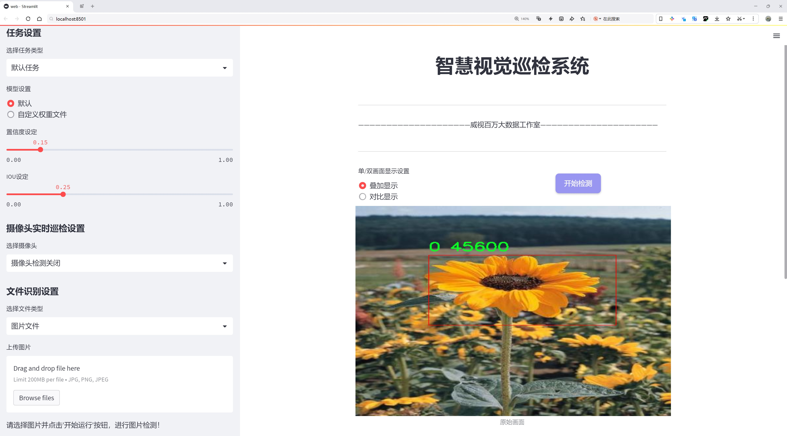
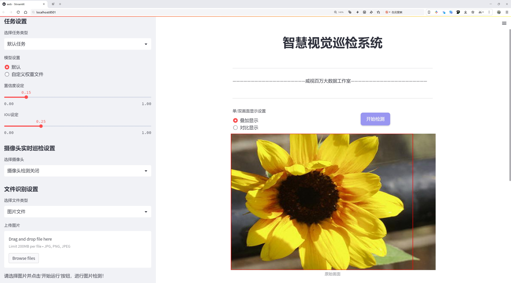
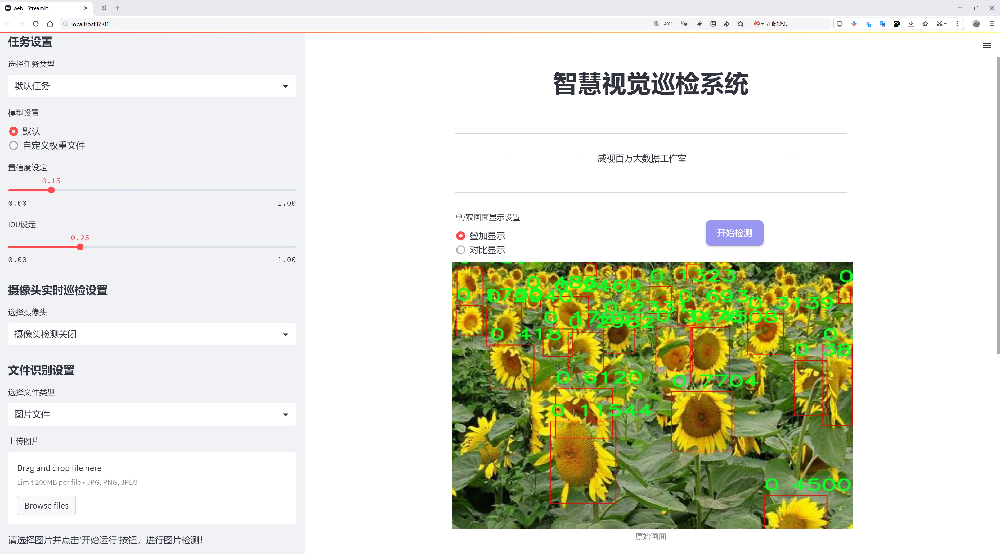
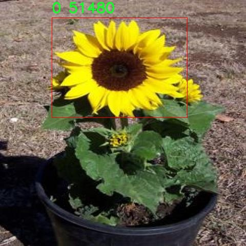
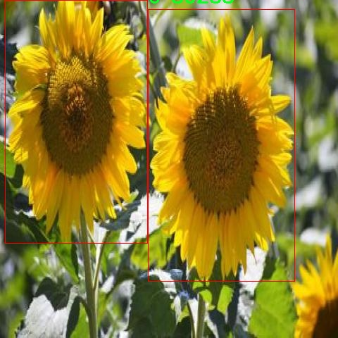
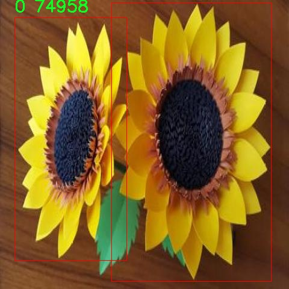
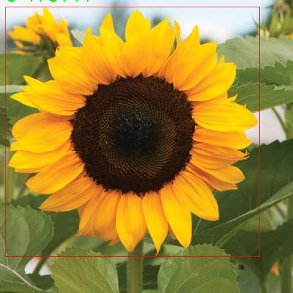

# 花卉检测检测系统源码分享
 # [一条龙教学YOLOV8标注好的数据集一键训练_70+全套改进创新点发刊_Web前端展示]

### 1.研究背景与意义

项目参考[AAAI Association for the Advancement of Artificial Intelligence](https://gitee.com/qunshansj/projects)

项目来源[AACV Association for the Advancement of Computer Vision](https://gitee.com/qunmasj/projects)

研究背景与意义

随着计算机视觉技术的迅速发展，物体检测作为其重要分支之一，已经在多个领域取得了显著的进展。尤其是在农业和园艺领域，花卉的自动检测与识别技术逐渐成为研究的热点。这不仅有助于提高花卉种植的管理效率，还能在生态监测、植物病害识别等方面发挥重要作用。近年来，YOLO（You Only Look Once）系列模型因其高效的实时检测能力而受到广泛关注。YOLOv8作为该系列的最新版本，具备了更强的特征提取能力和更快的推理速度，为花卉检测提供了新的可能性。

在花卉检测的研究中，数据集的构建是一个至关重要的环节。本研究所使用的数据集包含1900张花卉图像，虽然类别数量仅为1，但这并不妨碍我们深入探讨该类花卉的特征与变化。通过对这些图像的分析，可以提取出花卉在不同生长阶段、不同光照条件下的视觉特征，为后续的模型训练提供丰富的基础数据。尽管数据集相对较小，但在改进YOLOv8模型的过程中，通过数据增强技术、迁移学习等方法，可以有效提升模型的泛化能力和检测精度。

本研究的意义在于，首先，通过改进YOLOv8模型，能够实现对花卉的高效、准确检测，进而为智能农业提供技术支持。随着全球对绿色农业和可持续发展的重视，自动化的花卉检测系统将为农民和研究人员提供实时的数据支持，帮助他们更好地进行作物管理和病虫害防治。其次，基于该系统的研究还可以为其他植物的检测与识别提供借鉴，推动植物科学研究的进一步发展。

此外，花卉检测系统的开发不仅限于农业应用，其潜在的市场价值也不可忽视。在园艺设计、花卉市场分析等领域，准确的花卉检测技术可以帮助相关企业更好地进行市场定位和产品推广。因此，本研究的成果将有助于推动相关产业的发展，为经济增长注入新的活力。

综上所述，基于改进YOLOv8的花卉检测系统的研究，不仅具有重要的学术价值，也具备广泛的应用前景。通过对现有技术的改进与创新，我们期望能够在花卉检测领域开辟出新的研究方向，为实现农业现代化和智能化贡献力量。

### 2.图片演示







##### 注意：由于此博客编辑较早，上面“2.图片演示”和“3.视频演示”展示的系统图片或者视频可能为老版本，新版本在老版本的基础上升级如下：（实际效果以升级的新版本为准）

  （1）适配了YOLOV8的“目标检测”模型和“实例分割”模型，通过加载相应的权重（.pt）文件即可自适应加载模型。

  （2）支持“图片识别”、“视频识别”、“摄像头实时识别”三种识别模式。

  （3）支持“图片识别”、“视频识别”、“摄像头实时识别”三种识别结果保存导出，解决手动导出（容易卡顿出现爆内存）存在的问题，识别完自动保存结果并导出到tempDir中。

  （4）支持Web前端系统中的标题、背景图等自定义修改，后面提供修改教程。

  另外本项目提供训练的数据集和训练教程,暂不提供权重文件（best.pt）,需要您按照教程进行训练后实现图片演示和Web前端界面演示的效果。

### 3.视频演示

[3.1 视频演示](https://www.bilibili.com/video/BV1gAt8ehEvn/)

### 4.数据集信息展示

##### 4.1 本项目数据集详细数据（类别数＆类别名）

nc: 1
names: ['0']


##### 4.2 本项目数据集信息介绍

数据集信息展示

在本研究中，我们使用了名为“Flower”的数据集，旨在训练和改进YOLOv8模型，以实现高效的花卉检测系统。该数据集的设计初衷是为了解决花卉识别中的多样性和复杂性问题，提供一个标准化的训练基础，以提升模型在实际应用中的表现。数据集的类别数量为1，具体类别列表仅包含一个标签“0”，这意味着该数据集专注于一种特定类型的花卉，旨在深入挖掘这一类别的特征和变化。

“Flower”数据集的构建过程考虑到了花卉的多样性和生长环境的复杂性。虽然类别数量仅为1，但该类别下的样本数量和多样性却是丰富的。数据集中包含了不同生长阶段、不同光照条件以及不同背景下的花卉图像，这些因素都对花卉的外观产生了显著影响。因此，数据集不仅仅是简单的图像集合，而是一个经过精心挑选和标注的资源，旨在为YOLOv8模型提供全面的训练数据。

在数据采集过程中，研究团队通过多种渠道收集了大量的花卉图像，包括自然环境中的实地拍摄、园艺展览、以及用户生成的内容。这些图像涵盖了花卉的不同视角、姿态和状态，确保了数据集的多样性和代表性。此外，为了提高模型的鲁棒性，数据集中还包含了一些图像处理后的样本，例如不同的亮度、对比度和色彩调整，以模拟各种实际应用场景中可能遇到的条件。

数据集的标注工作由经验丰富的植物学专家和计算机视觉领域的研究人员共同完成。每一张图像都经过仔细的审查和标注，确保了数据的准确性和可靠性。标注不仅包括花卉的边界框，还涵盖了花卉的特征描述，这为后续的模型训练提供了丰富的信息。通过这种方式，数据集不仅为YOLOv8模型提供了必要的训练样本，还为模型的评估和优化提供了有价值的参考。

在模型训练过程中，数据集的使用将遵循严格的分割策略，以确保训练集、验证集和测试集的合理划分。这种划分不仅有助于评估模型的泛化能力，还能有效避免过拟合现象的发生。通过在不同的数据集上进行测试，研究团队能够获得模型在真实场景中的表现，从而不断调整和优化模型参数，以达到最佳的检测效果。

总之，“Flower”数据集为本研究提供了一个坚实的基础，助力于改进YOLOv8在花卉检测任务中的表现。通过对该数据集的深入分析和有效利用，我们期望能够开发出一个更加精准和高效的花卉检测系统，为植物识别和相关应用领域提供更强大的技术支持。










### 5.全套项目环境部署视频教程（零基础手把手教学）

[5.1 环境部署教程链接（零基础手把手教学）](https://www.ixigua.com/7404473917358506534?logTag=c807d0cbc21c0ef59de5)


[5.2 安装Python虚拟环境创建和依赖库安装视频教程链接（零基础手把手教学）](https://www.ixigua.com/7404474678003106304?logTag=1f1041108cd1f708b01a)

### 6.手把手YOLOV8训练视频教程（零基础小白有手就能学会）

[6.1 手把手YOLOV8训练视频教程（零基础小白有手就能学会）](https://www.ixigua.com/7404477157818401292?logTag=d31a2dfd1983c9668658)

### 7.70+种全套YOLOV8创新点代码加载调参视频教程（一键加载写好的改进模型的配置文件）

[7.1 70+种全套YOLOV8创新点代码加载调参视频教程（一键加载写好的改进模型的配置文件）](https://www.ixigua.com/7404478314661806627?logTag=29066f8288e3f4eea3a4)

### 8.70+种全套YOLOV8创新点原理讲解（非科班也可以轻松写刊发刊，V10版本正在科研待更新）

由于篇幅限制，每个创新点的具体原理讲解就不一一展开，具体见下列网址中的创新点对应子项目的技术原理博客网址【Blog】：


[8.1 70+种全套YOLOV8创新点原理讲解链接](https://gitee.com/qunmasj/good)

### 9.系统功能展示（检测对象为举例，实际内容以本项目数据集为准）

图9.1.系统支持检测结果表格显示

  图9.2.系统支持置信度和IOU阈值手动调节

  图9.3.系统支持自定义加载权重文件best.pt(需要你通过步骤5中训练获得)

  图9.4.系统支持摄像头实时识别

  图9.5.系统支持图片识别

  图9.6.系统支持视频识别

  图9.7.系统支持识别结果文件自动保存

  图9.8.系统支持Excel导出检测结果数据


### 10.原始YOLOV8算法原理

原始YOLOv8算法原理

YOLOv8算法作为目标检测领域的最新进展，承载着前沿的计算机视觉技术，旨在以更高的精度和效率进行目标检测。该算法在YOLO系列的基础上进行了多项重要的改进和优化，使其在复杂的场景中表现出色。YOLOv8的设计理念围绕着实时性和准确性展开，旨在满足现代应用对目标检测的严格要求。

首先，YOLOv8的骨干网络采用了跨级结构（Cross Stage Partial, CSP）的思想，这一设计使得网络在保持高效特征提取的同时，能够有效缓解深层网络中的梯度消失问题。具体而言，YOLOv8对YOLOv5中的C3模块进行了优化，替换为更轻量的C2f模块。C2f模块不仅减少了计算量，还保留了丰富的特征信息，使得网络在进行目标检测时能够更好地捕捉到目标的细节特征。

在特征提取方面，YOLOv8继续使用特征金字塔网络（FPN）来实现多尺度特征的融合。特征金字塔网络的引入，使得YOLOv8能够在不同尺度上有效地检测目标，从而提升了对小目标的检测能力。与之前的版本相比，YOLOv8在上采样阶段中删除了卷积结构，这一简化使得网络的计算效率得到了显著提升。

此外，YOLOv8引入了新的损失策略，以提高目标检测的准确性。通过变焦损失（VFLLoss）计算分类损失，结合数据平均保真度损失（DFLLoss）和完美交并比损失（CIoULoss）来计算边界框损失，这种新颖的损失函数设计使得YOLOv8在处理复杂场景时，能够更好地平衡分类和定位的精度。这种改进使得YOLOv8在面对样本不平衡和困难样本时，表现出更强的鲁棒性。

YOLOv8还采用了Anchor-Free的思想，摒弃了传统的Anchor-Base方法。这一变化使得目标检测的过程更加灵活，减少了对先验框的依赖，能够在更广泛的应用场景中实现高效的目标检测。通过新的样本匹配策略，YOLOv8实现了Task-Aligned的Assigner匹配方式，进一步提升了样本匹配的准确性和效率。

在数据预处理方面，YOLOv8借鉴了YOLOv5的策略，采用了多种数据增强技术，如马赛克增强、混合增强、空间扰动和颜色扰动等。这些增强手段的使用，使得模型在训练过程中能够接触到更多样化的样本，从而提升了模型的泛化能力。

YOLOv8的网络结构分为输入层、主干网络、特征融合层和解耦头。主干网络通过C2f模块进行特征提取，特征融合层则利用PAFPN结构实现多尺度特征的融合。解耦头部分则负责将融合后的特征图转换为最终的检测结果。通过将分类和回归分支解耦，YOLOv8能够在保持高效性的同时，提升检测的准确性。

值得一提的是，YOLOv8在输出阶段的特征图尺度为80x80、40x40和20x20，能够适应不同大小目标的检测需求。通过使用Distribution Focal Loss和CIoULoss，YOLOv8在分类和边框回归中实现了更高的精度。这一设计使得YOLOv8在面对小目标和复杂背景时，能够有效地进行目标检测。

总的来说，YOLOv8算法通过一系列的结构优化和损失函数改进，成功地提升了目标检测的精度和效率。其在处理复杂场景和多样化目标时展现出的优越性能，使其成为当前目标检测领域的一个重要里程碑。随着YOLOv8的推广和应用，预计将在智能监控、自动驾驶、人脸识别等多个领域发挥重要作用，为计算机视觉技术的发展注入新的活力。


### 11.项目核心源码讲解（再也不用担心看不懂代码逻辑）

#### 11.1 70+种YOLOv8算法改进源码大全和调试加载训练教程（非必要）\ultralytics\models\sam\modules\sam.py

以下是对给定代码的核心部分进行分析和详细注释的结果：

```python
# 导入必要的库
from typing import List
import torch
from torch import nn

# 导入解码器和编码器
from .decoders import MaskDecoder
from .encoders import ImageEncoderViT, PromptEncoder

class Sam(nn.Module):
    """
    Sam（Segment Anything Model）旨在进行对象分割任务。它使用图像编码器生成图像嵌入，并使用提示编码器对各种类型的输入提示进行编码。这些嵌入随后被掩码解码器用于预测对象掩码。

    属性：
        mask_threshold (float): 掩码预测的阈值。
        image_format (str): 输入图像的格式，默认为 'RGB'。
        image_encoder (ImageEncoderViT): 用于将图像编码为嵌入的主干网络。
        prompt_encoder (PromptEncoder): 编码各种类型的输入提示。
        mask_decoder (MaskDecoder): 从图像和提示嵌入中预测对象掩码。
        pixel_mean (List[float]): 用于图像归一化的均值像素值。
        pixel_std (List[float]): 用于图像归一化的标准差值。
    """
    # 掩码预测的阈值，默认为0.0
    mask_threshold: float = 0.0
    # 输入图像的格式，默认为 'RGB'
    image_format: str = 'RGB'

    def __init__(
        self,
        image_encoder: ImageEncoderViT,  # 图像编码器
        prompt_encoder: PromptEncoder,    # 提示编码器
        mask_decoder: MaskDecoder,        # 掩码解码器
        pixel_mean: List[float] = (123.675, 116.28, 103.53),  # 像素均值
        pixel_std: List[float] = (58.395, 57.12, 57.375)      # 像素标准差
    ) -> None:
        """
        初始化 Sam 类以从图像和输入提示中预测对象掩码。

        注意：
            所有的 forward() 操作已移至 SAMPredictor。

        参数：
            image_encoder (ImageEncoderViT): 用于将图像编码为图像嵌入的主干网络。
            prompt_encoder (PromptEncoder): 编码各种类型的输入提示。
            mask_decoder (MaskDecoder): 从图像嵌入和编码的提示中预测掩码。
            pixel_mean (List[float], optional): 用于归一化输入图像的均值值。默认为 (123.675, 116.28, 103.53)。
            pixel_std (List[float], optional): 用于归一化输入图像的标准差值。默认为 (58.395, 57.12, 57.375)。
        """
        super().__init__()  # 调用父类构造函数
        self.image_encoder = image_encoder  # 初始化图像编码器
        self.prompt_encoder = prompt_encoder  # 初始化提示编码器
        self.mask_decoder = mask_decoder  # 初始化掩码解码器
        # 注册像素均值和标准差，用于图像归一化
        self.register_buffer('pixel_mean', torch.Tensor(pixel_mean).view(-1, 1, 1), False)
        self.register_buffer('pixel_std', torch.Tensor(pixel_std).view(-1, 1, 1), False)
```

### 代码分析与注释
1. **类定义**：`Sam`类继承自`nn.Module`，是一个用于对象分割的模型。
2. **属性说明**：
   - `mask_threshold`：用于掩码预测的阈值，决定了哪些像素被认为是目标的一部分。
   - `image_format`：定义输入图像的格式，通常为RGB。
   - `image_encoder`、`prompt_encoder`、`mask_decoder`：分别负责图像编码、提示编码和掩码解码的模块。
   - `pixel_mean`和`pixel_std`：用于图像预处理的均值和标准差，确保输入图像在训练和推理时的一致性。
3. **构造函数**：
   - 接收编码器和解码器的实例，以及用于图像归一化的均值和标准差。
   - 使用`register_buffer`方法注册均值和标准差，以便在模型训练和推理过程中保持一致，但不将其视为模型的可学习参数。

以上是对代码的核心部分的提炼和详细注释，旨在帮助理解其功能和结构。

这个文件定义了一个名为 `Sam` 的类，它是用于对象分割任务的模型，称为“Segment Anything Model”。该模型的设计目的是通过图像编码器生成图像嵌入，并通过提示编码器对各种类型的输入提示进行编码。生成的嵌入随后被掩码解码器用于预测对象的掩码。

在类的属性中，`mask_threshold` 是用于掩码预测的阈值，`image_format` 则指定了输入图像的格式，默认为 'RGB'。`image_encoder` 是用于将图像编码为嵌入的主干网络，`prompt_encoder` 用于编码不同类型的输入提示，`mask_decoder` 则负责从图像和提示嵌入中预测对象掩码。此外，`pixel_mean` 和 `pixel_std` 分别用于图像归一化的均值和标准差。

在 `__init__` 方法中，`Sam` 类被初始化为从图像和输入提示中预测对象掩码。构造函数接收三个主要参数：`image_encoder`、`prompt_encoder` 和 `mask_decoder`，这些参数分别用于图像编码、提示编码和掩码预测。`pixel_mean` 和 `pixel_std` 是可选参数，用于对输入图像进行归一化处理，默认值分别为 (123.675, 116.28, 103.53) 和 (58.395, 57.12, 57.375)。

在初始化过程中，使用 `super().__init__()` 调用父类的构造函数，并将图像编码器、提示编码器和掩码解码器赋值给相应的实例变量。同时，使用 `register_buffer` 方法将均值和标准差注册为模型的缓冲区，这样它们在模型的状态字典中会被保存和加载，但不会被视为模型的参数。

总的来说，这个文件的核心功能是构建一个用于对象分割的模型框架，集成了图像编码、提示编码和掩码解码的功能，为后续的掩码预测提供了基础。

#### 11.2 ui.py

```python
import sys
import subprocess

def run_script(script_path):
    """
    使用当前 Python 环境运行指定的脚本。

    Args:
        script_path (str): 要运行的脚本路径

    Returns:
        None
    """
    # 获取当前 Python 解释器的路径
    python_path = sys.executable

    # 构建运行命令，使用 streamlit 运行指定的脚本
    command = f'"{python_path}" -m streamlit run "{script_path}"'

    # 执行命令
    result = subprocess.run(command, shell=True)
    # 检查命令执行结果，如果返回码不为0，则表示出错
    if result.returncode != 0:
        print("脚本运行出错。")

# 主程序入口
if __name__ == "__main__":
    # 指定要运行的脚本路径
    script_path = "web.py"  # 这里可以直接指定脚本路径

    # 调用函数运行脚本
    run_script(script_path)
```

### 代码核心部分及注释说明：

1. **导入模块**：
   - `sys`：用于获取当前 Python 解释器的路径。
   - `subprocess`：用于执行外部命令。

2. **定义 `run_script` 函数**：
   - 该函数接受一个参数 `script_path`，表示要运行的 Python 脚本的路径。
   - 使用 `sys.executable` 获取当前 Python 解释器的路径，以确保使用正确的 Python 环境来运行脚本。
   - 构建命令字符串，使用 `streamlit` 模块运行指定的脚本。
   - 使用 `subprocess.run` 执行构建的命令，并检查返回码，以判断脚本是否成功运行。

3. **主程序入口**：
   - 使用 `if __name__ == "__main__":` 确保只有在直接运行该脚本时才会执行以下代码。
   - 指定要运行的脚本路径 `web.py`。
   - 调用 `run_script` 函数，传入脚本路径以执行该脚本。

这个程序文件的主要功能是使用当前的 Python 环境来运行一个指定的脚本，具体是通过 Streamlit 来启动一个 Web 应用。程序首先导入了必要的模块，包括 `sys`、`os` 和 `subprocess`，以及一个自定义的 `abs_path` 函数，用于获取脚本的绝对路径。

在 `run_script` 函数中，首先获取当前 Python 解释器的路径，这通过 `sys.executable` 实现。接着，构建一个命令字符串，这个命令将使用当前的 Python 解释器来运行指定的脚本，具体的命令格式是 `python -m streamlit run script_path`。然后，使用 `subprocess.run` 方法来执行这个命令，`shell=True` 参数允许在 shell 中执行命令。

如果脚本运行出现错误，程序会检查返回的状态码，如果不为零，则打印出“脚本运行出错”的提示信息。

在文件的最后部分，使用 `if __name__ == "__main__":` 语句来确保只有在直接运行该文件时才会执行下面的代码。这里指定了要运行的脚本路径为 `web.py`，并调用 `run_script` 函数来启动这个脚本。

总的来说，这个程序的作用是简化通过 Streamlit 启动 Web 应用的过程，确保在正确的 Python 环境中运行指定的脚本。

#### 11.3 code\ultralytics\models\rtdetr\val.py

以下是经过简化和注释的核心代码部分：

```python
import torch
from ultralytics.data import YOLODataset
from ultralytics.models.yolo.detect import DetectionValidator
from ultralytics.utils import ops

class RTDETRDataset(YOLODataset):
    """
    RT-DETR数据集类，继承自YOLODataset类，专为实时目标检测和跟踪任务设计。
    """

    def __init__(self, *args, data=None, **kwargs):
        """初始化RTDETRDataset类，调用父类构造函数。"""
        super().__init__(*args, data=data, **kwargs)

    def load_image(self, i, rect_mode=False):
        """加载数据集中索引为'i'的图像，返回图像及其调整后的尺寸。"""
        return super().load_image(i=i, rect_mode=rect_mode)

    def build_transforms(self, hyp=None):
        """构建图像变换操作，仅用于评估阶段。"""
        transforms = []
        if self.augment:
            # 如果启用增强，构建相应的变换
            transforms = v8_transforms(self, self.imgsz, hyp, stretch=True)
        transforms.append(
            # 格式化边界框，归一化处理
            Format(
                bbox_format="xywh",
                normalize=True,
                return_mask=self.use_segments,
                return_keypoint=self.use_keypoints,
                batch_idx=True,
                mask_ratio=hyp.mask_ratio,
                mask_overlap=hyp.overlap_mask,
            )
        )
        return transforms


class RTDETRValidator(DetectionValidator):
    """
    RTDETRValidator类，扩展了DetectionValidator类，提供专门针对RT-DETR模型的验证功能。
    """

    def build_dataset(self, img_path, mode="val", batch=None):
        """
        构建RTDETR数据集。

        Args:
            img_path (str): 图像文件夹路径。
            mode (str): 模式（训练或验证），可自定义不同的增强方式。
            batch (int, optional): 批量大小，仅适用于矩形模式。
        """
        return RTDETRDataset(
            img_path=img_path,
            imgsz=self.args.imgsz,
            batch_size=batch,
            augment=False,  # 不进行增强
            hyp=self.args,
            rect=False,  # 不使用矩形模式
            cache=self.args.cache or None,
            data=self.data,
        )

    def postprocess(self, preds):
        """对预测结果应用非极大值抑制（NMS）。"""
        bs, _, nd = preds[0].shape  # bs: 批量大小, nd: 预测维度
        bboxes, scores = preds[0].split((4, nd - 4), dim=-1)  # 分离边界框和分数
        bboxes *= self.args.imgsz  # 缩放边界框
        outputs = [torch.zeros((0, 6), device=bboxes.device)] * bs  # 初始化输出
        for i, bbox in enumerate(bboxes):
            bbox = ops.xywh2xyxy(bbox)  # 转换边界框格式
            score, cls = scores[i].max(-1)  # 获取最大分数和对应类别
            pred = torch.cat([bbox, score[..., None], cls[..., None]], dim=-1)  # 合并边界框、分数和类别
            pred = pred[score.argsort(descending=True)]  # 按分数排序
            outputs[i] = pred  # 保存结果

        return outputs

    def _prepare_batch(self, si, batch):
        """准备训练或推理的批次，应用变换。"""
        idx = batch["batch_idx"] == si  # 获取当前索引
        cls = batch["cls"][idx].squeeze(-1)  # 类别
        bbox = batch["bboxes"][idx]  # 边界框
        ori_shape = batch["ori_shape"][si]  # 原始图像尺寸
        imgsz = batch["img"].shape[2:]  # 图像尺寸
        ratio_pad = batch["ratio_pad"][si]  # 填充比例
        if len(cls):
            bbox = ops.xywh2xyxy(bbox)  # 转换边界框格式
            bbox[..., [0, 2]] *= ori_shape[1]  # 转换为原始空间
            bbox[..., [1, 3]] *= ori_shape[0]  # 转换为原始空间
        return dict(cls=cls, bbox=bbox, ori_shape=ori_shape, imgsz=imgsz, ratio_pad=ratio_pad)

    def _prepare_pred(self, pred, pbatch):
        """准备并返回转换后的边界框和类别标签。"""
        predn = pred.clone()  # 克隆预测结果
        predn[..., [0, 2]] *= pbatch["ori_shape"][1] / self.args.imgsz  # 转换为原始空间
        predn[..., [1, 3]] *= pbatch["ori_shape"][0] / self.args.imgsz  # 转换为原始空间
        return predn.float()  # 返回浮点型结果
```

### 代码说明：
1. **RTDETRDataset类**：这是一个数据集类，专门为RT-DETR模型设计，继承自YOLODataset。它实现了图像加载和变换构建的方法。
2. **load_image方法**：从数据集中加载指定索引的图像，并返回图像及其调整后的尺寸。
3. **build_transforms方法**：根据是否启用数据增强来构建图像变换操作。
4. **RTDETRValidator类**：扩展了DetectionValidator类，提供RT-DETR模型的验证功能。
5. **build_dataset方法**：构建RT-DETR数据集，支持训练和验证模式。
6. **postprocess方法**：对预测结果应用非极大值抑制，处理边界框和分数。
7. **_prepare_batch和_prepare_pred方法**：分别用于准备训练批次和处理预测结果，确保边界框和类别标签的格式正确。

这个程序文件是一个用于RT-DETR（实时检测与跟踪）模型验证的Python脚本，主要包括两个类：`RTDETRDataset`和`RTDETRValidator`。首先，`RTDETRDataset`类继承自`YOLODataset`，专门为RT-DETR模型设计，优化了实时检测和跟踪任务。它的构造函数调用了父类的构造函数，并重写了`load_image`方法，以加载指定索引的图像。`build_transforms`方法用于构建图像变换，支持不同的增强方式，并根据需要返回格式化的边界框、掩码和关键点。

接下来，`RTDETRValidator`类继承自`DetectionValidator`，提供了针对RT-DETR模型的验证功能。它可以构建RT-DETR特定的数据集，应用非极大值抑制（NMS）进行后处理，并更新评估指标。`build_dataset`方法用于创建数据集，接受图像路径、模式（训练或验证）和批量大小作为参数。`postprocess`方法对预测结果应用NMS，提取边界框和分数，并根据置信度排序，最终返回处理后的输出。

此外，`_prepare_batch`和`_prepare_pred`方法分别用于准备训练或推理的批次数据和转换后的预测结果。这些方法确保在进行评估时，边界框和类标签的格式正确，并将预测结果转换为原始图像空间的坐标。

总体而言，这个文件为RT-DETR模型的验证提供了必要的工具和功能，确保模型在实时检测和跟踪任务中的有效性。

#### 11.4 train.py

以下是经过简化和注释的核心代码部分，主要保留了与YOLO检测模型训练相关的功能：

```python
import random
import numpy as np
import torch.nn as nn
from ultralytics.data import build_dataloader, build_yolo_dataset
from ultralytics.engine.trainer import BaseTrainer
from ultralytics.models import yolo
from ultralytics.nn.tasks import DetectionModel
from ultralytics.utils import LOGGER, RANK
from ultralytics.utils.torch_utils import de_parallel, torch_distributed_zero_first

class DetectionTrainer(BaseTrainer):
    """
    基于检测模型的训练类，继承自BaseTrainer类。
    """

    def build_dataset(self, img_path, mode="train", batch=None):
        """
        构建YOLO数据集。

        参数:
            img_path (str): 包含图像的文件夹路径。
            mode (str): 模式，`train`表示训练模式，`val`表示验证模式。
            batch (int, optional): 批次大小，仅用于`rect`模式。默认为None。
        """
        gs = max(int(de_parallel(self.model).stride.max() if self.model else 0), 32)  # 获取模型的最大步幅
        return build_yolo_dataset(self.args, img_path, batch, self.data, mode=mode, rect=mode == "val", stride=gs)

    def get_dataloader(self, dataset_path, batch_size=16, rank=0, mode="train"):
        """构建并返回数据加载器。"""
        assert mode in ["train", "val"]  # 确保模式有效
        with torch_distributed_zero_first(rank):  # 仅在DDP中初始化数据集*.cache一次
            dataset = self.build_dataset(dataset_path, mode, batch_size)  # 构建数据集
        shuffle = mode == "train"  # 训练模式下打乱数据
        workers = self.args.workers if mode == "train" else self.args.workers * 2  # 根据模式设置工作线程数
        return build_dataloader(dataset, batch_size, workers, shuffle, rank)  # 返回数据加载器

    def preprocess_batch(self, batch):
        """对图像批次进行预处理，包括缩放和转换为浮点数。"""
        batch["img"] = batch["img"].to(self.device, non_blocking=True).float() / 255  # 将图像转换为浮点数并归一化
        if self.args.multi_scale:  # 如果启用多尺度
            imgs = batch["img"]
            sz = (
                random.randrange(self.args.imgsz * 0.5, self.args.imgsz * 1.5 + self.stride)
                // self.stride
                * self.stride
            )  # 随机选择图像大小
            sf = sz / max(imgs.shape[2:])  # 计算缩放因子
            if sf != 1:
                ns = [
                    math.ceil(x * sf / self.stride) * self.stride for x in imgs.shape[2:]
                ]  # 计算新的形状
                imgs = nn.functional.interpolate(imgs, size=ns, mode="bilinear", align_corners=False)  # 进行插值缩放
            batch["img"] = imgs  # 更新批次图像
        return batch

    def get_model(self, cfg=None, weights=None, verbose=True):
        """返回YOLO检测模型。"""
        model = DetectionModel(cfg, nc=self.data["nc"], verbose=verbose and RANK == -1)  # 创建检测模型
        if weights:
            model.load(weights)  # 加载权重
        return model

    def plot_training_samples(self, batch, ni):
        """绘制带有注释的训练样本。"""
        plot_images(
            images=batch["img"],
            batch_idx=batch["batch_idx"],
            cls=batch["cls"].squeeze(-1),
            bboxes=batch["bboxes"],
            paths=batch["im_file"],
            fname=self.save_dir / f"train_batch{ni}.jpg",
            on_plot=self.on_plot,
        )

    def plot_metrics(self):
        """从CSV文件中绘制指标。"""
        plot_results(file=self.csv, on_plot=self.on_plot)  # 保存结果图
```

### 代码说明：
1. **DetectionTrainer类**：继承自`BaseTrainer`，用于YOLO模型的训练。
2. **build_dataset方法**：根据给定的图像路径和模式构建YOLO数据集。
3. **get_dataloader方法**：构建并返回数据加载器，支持分布式训练。
4. **preprocess_batch方法**：对输入的图像批次进行预处理，包括归一化和多尺度调整。
5. **get_model方法**：创建并返回YOLO检测模型，可以选择加载预训练权重。
6. **plot_training_samples方法**：绘制训练样本及其对应的注释，便于可视化训练过程。
7. **plot_metrics方法**：从CSV文件中绘制训练指标，帮助监控训练效果。

这个程序文件 `train.py` 是一个用于训练 YOLO（You Only Look Once）目标检测模型的实现，继承自 `BaseTrainer` 类。文件中包含了多个方法，主要用于构建数据集、加载数据、预处理图像、设置模型属性、获取模型、验证模型、记录损失、显示训练进度、绘制训练样本和绘制训练指标等。

首先，`DetectionTrainer` 类的构造函数中定义了如何构建数据集。`build_dataset` 方法接收图像路径、模式（训练或验证）和批量大小作为参数，使用 `build_yolo_dataset` 函数来创建 YOLO 数据集。这个方法根据模型的步幅（stride）来调整图像的大小，以适应模型的输入要求。

接着，`get_dataloader` 方法用于构建并返回数据加载器。它根据模式选择是否打乱数据，并设置工作线程的数量。这个方法确保在分布式训练中，数据集只初始化一次，以提高效率。

在图像预处理方面，`preprocess_batch` 方法将图像转换为浮点数并进行缩放。如果启用了多尺度训练，它会随机选择一个新的图像大小，并对图像进行插值处理，以确保图像尺寸符合模型要求。

`set_model_attributes` 方法用于设置模型的属性，包括类别数量和类别名称。这些属性是根据数据集的标签信息来配置的。

`get_model` 方法返回一个 YOLO 检测模型实例，如果提供了权重文件，还会加载这些权重。`get_validator` 方法则返回一个用于验证模型的 `DetectionValidator` 实例，方便在训练过程中进行模型评估。

在损失记录方面，`label_loss_items` 方法将训练损失项转换为字典格式，便于后续的记录和分析。`progress_string` 方法返回一个格式化的字符串，显示训练进度，包括当前的轮次、GPU 内存使用情况、损失值、实例数量和图像大小等信息。

此外，`plot_training_samples` 方法用于绘制训练样本及其标注，方便可视化训练数据的质量。最后，`plot_metrics` 和 `plot_training_labels` 方法分别用于绘制训练过程中的指标和标签，以便分析模型的训练效果。

总体而言，这个文件实现了 YOLO 模型训练的各个方面，从数据准备到模型训练和评估，提供了一个完整的训练框架。

#### 11.5 70+种YOLOv8算法改进源码大全和调试加载训练教程（非必要）\ultralytics\nn\backbone\fasternet.py

以下是提取出的核心代码部分，并附上详细的中文注释：

```python
import torch
import torch.nn as nn
from typing import List
from torch import Tensor

class Partial_conv3(nn.Module):
    """部分卷积层，用于处理输入的不同部分"""
    
    def __init__(self, dim, n_div, forward):
        super().__init__()
        self.dim_conv3 = dim // n_div  # 计算部分卷积的维度
        self.dim_untouched = dim - self.dim_conv3  # 计算未处理部分的维度
        self.partial_conv3 = nn.Conv2d(self.dim_conv3, self.dim_conv3, 3, 1, 1, bias=False)  # 定义卷积层

        # 根据前向传播方式选择不同的前向传播函数
        if forward == 'slicing':
            self.forward = self.forward_slicing
        elif forward == 'split_cat':
            self.forward = self.forward_split_cat
        else:
            raise NotImplementedError

    def forward_slicing(self, x: Tensor) -> Tensor:
        """仅用于推理阶段的前向传播"""
        x = x.clone()  # 保持原始输入不变，以便后续的残差连接
        x[:, :self.dim_conv3, :, :] = self.partial_conv3(x[:, :self.dim_conv3, :, :])  # 处理部分输入
        return x

    def forward_split_cat(self, x: Tensor) -> Tensor:
        """用于训练和推理阶段的前向传播"""
        x1, x2 = torch.split(x, [self.dim_conv3, self.dim_untouched], dim=1)  # 将输入分成两部分
        x1 = self.partial_conv3(x1)  # 处理第一部分
        x = torch.cat((x1, x2), 1)  # 将处理后的部分和未处理部分拼接
        return x


class MLPBlock(nn.Module):
    """多层感知机块，包含卷积和激活函数"""
    
    def __init__(self, dim, n_div, mlp_ratio, drop_path, layer_scale_init_value, act_layer, norm_layer, pconv_fw_type):
        super().__init__()
        self.dim = dim
        self.mlp_ratio = mlp_ratio
        self.drop_path = nn.Identity() if drop_path <= 0 else DropPath(drop_path)  # 定义随机深度
        self.n_div = n_div

        mlp_hidden_dim = int(dim * mlp_ratio)  # 计算隐藏层维度

        # 定义多层感知机的层
        mlp_layer: List[nn.Module] = [
            nn.Conv2d(dim, mlp_hidden_dim, 1, bias=False),
            norm_layer(mlp_hidden_dim),
            act_layer(),
            nn.Conv2d(mlp_hidden_dim, dim, 1, bias=False)
        ]

        self.mlp = nn.Sequential(*mlp_layer)  # 将层组合成一个序列

        # 定义空间混合层
        self.spatial_mixing = Partial_conv3(dim, n_div, pconv_fw_type)

    def forward(self, x: Tensor) -> Tensor:
        """前向传播"""
        shortcut = x  # 保存输入以便进行残差连接
        x = self.spatial_mixing(x)  # 进行空间混合
        x = shortcut + self.drop_path(self.mlp(x))  # 残差连接
        return x


class FasterNet(nn.Module):
    """FasterNet模型定义"""
    
    def __init__(self, in_chans=3, num_classes=1000, embed_dim=96, depths=(1, 2, 8, 2), mlp_ratio=2., n_div=4,
                 patch_size=4, patch_stride=4, patch_size2=2, patch_stride2=2, patch_norm=True, drop_path_rate=0.1,
                 layer_scale_init_value=0, norm_layer='BN', act_layer='RELU', pconv_fw_type='split_cat'):
        super().__init__()

        # 定义归一化层和激活函数
        norm_layer = nn.BatchNorm2d if norm_layer == 'BN' else NotImplementedError
        act_layer = nn.GELU if act_layer == 'GELU' else partial(nn.ReLU, inplace=True)

        self.patch_embed = PatchEmbed(patch_size, patch_stride, in_chans, embed_dim, norm_layer if patch_norm else None)  # 定义补丁嵌入层

        # 随机深度衰减规则
        dpr = [x.item() for x in torch.linspace(0, drop_path_rate, sum(depths))]

        # 构建网络层
        stages_list = []
        for i_stage in range(len(depths)):
            stage = BasicStage(dim=int(embed_dim * 2 ** i_stage), n_div=n_div, depth=depths[i_stage],
                               mlp_ratio=mlp_ratio, drop_path=dpr[sum(depths[:i_stage]):sum(depths[:i_stage + 1])],
                               layer_scale_init_value=layer_scale_init_value, norm_layer=norm_layer,
                               act_layer=act_layer, pconv_fw_type=pconv_fw_type)
            stages_list.append(stage)

            # 添加补丁合并层
            if i_stage < len(depths) - 1:
                stages_list.append(PatchMerging(patch_size2=patch_size2, patch_stride2=patch_stride2,
                                                 dim=int(embed_dim * 2 ** i_stage), norm_layer=norm_layer))

        self.stages = nn.Sequential(*stages_list)  # 将所有层组合成一个序列

    def forward(self, x: Tensor) -> Tensor:
        """前向传播，输出四个阶段的特征"""
        x = self.patch_embed(x)  # 进行补丁嵌入
        outs = []
        for idx, stage in enumerate(self.stages):
            x = stage(x)  # 通过每个阶段
            if idx in [0, 2, 4, 6]:  # 选择输出的层
                norm_layer = getattr(self, f'norm{idx}')
                x_out = norm_layer(x)
                outs.append(x_out)
        return outs  # 返回各阶段的输出特征
```

### 代码核心部分解释：
1. **Partial_conv3**: 该类实现了部分卷积操作，允许在输入的不同部分上进行卷积，支持两种前向传播方式（切片和拼接）。
2. **MLPBlock**: 该类实现了多层感知机的结构，包含卷积、归一化和激活函数，并支持残差连接。
3. **FasterNet**: 这是整个模型的主类，负责构建网络的各个阶段，处理输入数据并输出特征。它包含补丁嵌入、多个基本阶段和补丁合并层。

以上是代码的核心部分及其详细注释，旨在帮助理解模型的结构和功能。

这个程序文件是一个实现了FasterNet模型的PyTorch代码，主要用于计算机视觉任务，特别是目标检测和图像分类。代码的结构清晰，包含多个类和函数，每个部分都有其特定的功能。

首先，文件引入了一些必要的库，包括PyTorch、YAML和其他辅助模块。接着，定义了多个类，其中最重要的是`FasterNet`类，它是整个模型的核心。该类的构造函数接收多个参数，包括输入通道数、类别数、嵌入维度、各个阶段的深度、MLP比率等。模型的构建过程包括将输入图像分割成不重叠的补丁，随后通过多个阶段的处理来提取特征。

在`FasterNet`类中，首先定义了一个`PatchEmbed`类，用于将输入图像转换为补丁并进行嵌入。接着，定义了`BasicStage`和`MLPBlock`类，这些类负责构建模型的各个阶段和每个阶段中的多层感知机（MLP）模块。`Partial_conv3`类则实现了一种特殊的卷积操作，支持在训练和推理时使用不同的前向传播方式。

模型的前向传播方法会依次通过各个阶段，并在特定的层输出特征，方便后续的密集预测任务。代码中还定义了一些函数，如`update_weight`，用于更新模型的权重，以及多个用于创建不同版本FasterNet的函数（如`fasternet_t0`、`fasternet_t1`等），这些函数会加载相应的配置文件和预训练权重。

最后，在`__main__`部分，代码展示了如何实例化一个FasterNet模型并进行简单的测试，包括打印模型的输出通道和输入张量的尺寸。这段代码展示了如何使用这个模型进行推理。

整体而言，这个文件实现了一个灵活且可扩展的FasterNet模型，适用于各种计算机视觉任务，且提供了良好的配置和权重加载机制。

#### 11.6 code\ultralytics\utils\callbacks\dvc.py

以下是代码中最核心的部分，并附上详细的中文注释：

```python
# 导入必要的库
from ultralytics.utils import LOGGER, SETTINGS, TESTS_RUNNING, checks

try:
    # 确保当前不是在测试模式下
    assert not TESTS_RUNNING  
    # 确保DVC集成已启用
    assert SETTINGS["dvc"] is True  
    import dvclive  # 导入DVCLive库

    # 检查DVCLive的版本
    assert checks.check_version("dvclive", "2.11.0", verbose=True)

    import os
    import re
    from pathlib import Path

    # DVCLive日志记录实例
    live = None
    _processed_plots = {}  # 存储已处理的图表

    # 训练周期标志
    _training_epoch = False

except (ImportError, AssertionError, TypeError):
    dvclive = None  # 如果导入失败，则将dvclive设置为None


def _log_images(path, prefix=""):
    """使用DVCLive记录指定路径的图像，带有可选前缀。"""
    if live:  # 如果DVCLive实例存在
        name = path.name  # 获取图像文件名

        # 通过批次分组图像，以便在UI中启用滑块
        m = re.search(r"_batch(\d+)", name)
        if m:
            ni = m[1]  # 获取批次号
            new_stem = re.sub(r"_batch(\d+)", "_batch", path.stem)  # 替换文件名中的批次信息
            name = (Path(new_stem) / ni).with_suffix(path.suffix)  # 生成新的文件名

        live.log_image(os.path.join(prefix, name), path)  # 记录图像


def on_train_start(trainer):
    """如果DVCLive日志记录处于活动状态，则记录训练参数。"""
    if live:
        live.log_params(trainer.args)  # 记录训练参数


def on_fit_epoch_end(trainer):
    """在每个训练周期结束时记录训练指标和模型信息。"""
    global _training_epoch
    if live and _training_epoch:  # 如果DVCLive实例存在且当前是训练周期
        all_metrics = {**trainer.label_loss_items(trainer.tloss, prefix="train"), **trainer.metrics, **trainer.lr}
        for metric, value in all_metrics.items():
            live.log_metric(metric, value)  # 记录每个指标的值

        _log_plots(trainer.plots, "train")  # 记录训练过程中的图表
        live.next_step()  # 进入下一个步骤
        _training_epoch = False  # 重置训练周期标志


def on_train_end(trainer):
    """在训练结束时记录最佳指标、图表和混淆矩阵。"""
    if live:
        all_metrics = {**trainer.label_loss_items(trainer.tloss, prefix="train"), **trainer.metrics, **trainer.lr}
        for metric, value in all_metrics.items():
            live.log_metric(metric, value, plot=False)  # 记录最佳指标

        _log_confusion_matrix(trainer.validator)  # 记录混淆矩阵
        live.end()  # 结束日志记录


# 定义回调函数
callbacks = (
    {
        "on_train_start": on_train_start,
        "on_fit_epoch_end": on_fit_epoch_end,
        "on_train_end": on_train_end,
    }
    if dvclive
    else {}
)
```

### 代码说明：
1. **导入模块**：导入了Ultralytics YOLO库中的一些工具和DVCLive库，用于训练过程中的日志记录。
2. **异常处理**：确保在运行时不处于测试状态，并检查DVC集成是否启用。如果有任何导入错误或断言失败，将`dvclive`设置为`None`。
3. **日志记录函数**：
   - `_log_images`：记录图像到DVCLive，支持批次分组。
   - `on_train_start`：在训练开始时记录训练参数。
   - `on_fit_epoch_end`：在每个训练周期结束时记录训练指标和图表。
   - `on_train_end`：在训练结束时记录最佳指标和混淆矩阵。
4. **回调函数**：根据是否启用DVCLive，定义相应的回调函数。

这个程序文件是用于Ultralytics YOLO模型训练过程中的回调函数实现，主要集成了DVCLive库来记录和可视化训练过程中的各种信息。首先，文件导入了一些必要的模块和库，包括日志记录器、设置、检查函数等。它通过assert语句确保在测试运行时不记录日志，并验证DVCLive集成是否启用。

在尝试导入DVCLive时，如果导入失败或发生断言错误，程序会将dvclive设置为None，确保后续代码不会因缺少依赖而崩溃。接下来，定义了一些辅助函数用于记录图像、绘图和混淆矩阵。`_log_images`函数会根据指定路径和前缀记录图像，并支持通过批次分组以便在用户界面中显示滑块。`_log_plots`函数则记录训练过程中的绘图信息，确保每个绘图只处理一次。`_log_confusion_matrix`函数用于记录混淆矩阵，以便在模型验证时评估分类性能。

在训练的不同阶段，程序定义了一系列回调函数。例如，`on_pretrain_routine_start`函数在预训练开始时初始化DVCLive记录器，并记录相关信息；`on_train_start`函数在训练开始时记录训练参数；`on_fit_epoch_end`函数在每个训练周期结束时记录训练指标和模型信息，并推进到下一个步骤；`on_train_end`函数在训练结束时记录最佳指标、绘图和混淆矩阵。

最后，程序通过一个字典将这些回调函数与相应的事件关联起来，只有在DVCLive可用时才会激活这些回调。整体来看，这个文件的主要功能是通过DVCLive库实现对YOLO模型训练过程的实时监控和记录，帮助用户更好地理解和分析模型的训练效果。

### 12.系统整体结构（节选）

### 整体功能和构架概括

该项目是一个基于YOLOv8的目标检测和分割模型的实现，涵盖了多个方面的功能，包括模型定义、训练、验证、回调记录、数据处理等。项目的架构设计清晰，各个模块相互独立又紧密协作，形成了一个完整的训练和推理框架。主要功能包括：

1. **模型定义**：实现了YOLOv8及其变种（如RT-DETR、FasterNet等）的模型结构，支持多种网络架构和改进。
2. **训练与验证**：提供了训练和验证的完整流程，包括数据集构建、损失计算、指标记录等。
3. **回调机制**：集成了DVCLive等工具，实时记录训练过程中的各类信息，方便可视化和分析。
4. **数据处理**：实现了数据集的加载、预处理和增强，支持多种输入格式和标签。
5. **工具函数**：提供了各种实用工具函数，支持模型的构建、训练过程的可视化等。

### 文件功能整理表

| 文件路径                                                                                          | 功能描述                                                                                     |
|---------------------------------------------------------------------------------------------------|----------------------------------------------------------------------------------------------|
| `ultralytics/models/sam/modules/sam.py`                                                          | 定义了Segment Anything Model (SAM)类，用于对象分割任务，集成图像编码、提示编码和掩码解码功能。 |
| `ui.py`                                                                                          | 启动Streamlit Web应用，简化通过Streamlit运行指定脚本的过程。                              |
| `code/ultralytics/models/rtdetr/val.py`                                                          | 实现RT-DETR模型的验证功能，包括数据集构建、后处理和评估指标计算。                         |
| `train.py`                                                                                        | 负责YOLO模型的训练过程，包括数据集构建、模型训练、损失记录和训练进度显示。                |
| `ultralytics/nn/backbone/fasternet.py`                                                          | 实现FasterNet模型，提供特征提取和嵌入的功能，适用于目标检测和图像分类。                   |
| `ultralytics/utils/callbacks/dvc.py`                                                            | 集成DVCLive库，记录和可视化训练过程中的信息，支持实时监控和分析。                        |
| `ultralytics/models/utils/ops.py`                                                                | 提供各种操作和工具函数，支持模型的构建和推理过程。                                        |
| `ultralytics/nn/modules/block.py`                                                                | 定义了模型的基本模块和结构，支持构建复杂的神经网络架构。                                   |
| `ultralytics/data/split_dota.py`                                                                 | 实现DOTA数据集的分割和处理功能，支持数据集的加载和预处理。                                 |
| `ultralytics/hub/__init__.py`                                                                    | 提供模型的加载和管理功能，支持从Hub获取预训练模型。                                       |
| `ultralytics/trackers/__init__.py`                                                               | 定义跟踪器的初始化和管理功能，支持目标跟踪任务。                                           |
| `ultralytics/nn/extra_modules/block.py`                                                          | 实现额外的网络模块，扩展YOLO模型的功能和灵活性。                                           |
| `ultralytics/trackers/utils/__init__.py`                                                        | 提供跟踪器的工具函数和辅助功能，支持目标跟踪过程中的各种操作。                            |

这个表格总结了项目中各个文件的主要功能，帮助理解整个项目的结构和各个模块之间的关系。

注意：由于此博客编辑较早，上面“11.项目核心源码讲解（再也不用担心看不懂代码逻辑）”中部分代码可能会优化升级，仅供参考学习，完整“训练源码”、“Web前端界面”和“70+种创新点源码”以“13.完整训练+Web前端界面+70+种创新点源码、数据集获取”的内容为准。

### 13.完整训练+Web前端界面+70+种创新点源码、数据集获取


# [下载链接：https://mbd.pub/o/bread/ZpuWlJ1q](https://mbd.pub/o/bread/ZpuWlJ1q)